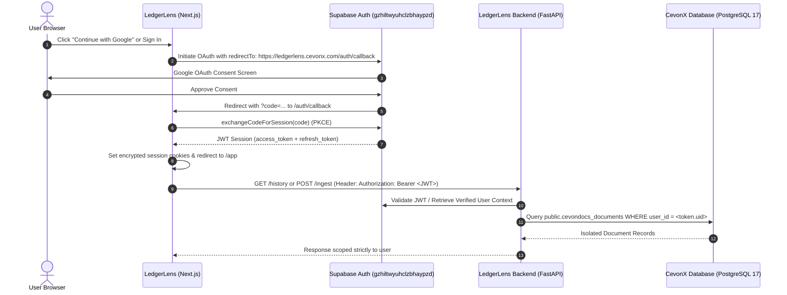

# LedgerLens — CevonX Central Authentication Integration

This document defines the architecture, data isolation guarantees, and deployment configuration for authentication within **LedgerLens** (*A CevonX Product*).

---

## 1. Unified Identity Architecture

LedgerLens participates in the central **CevonX Products** authentication system. 

Users authenticate once and maintain a single identity across the entire CevonX ecosystem:
- **CevonX Product Studio**: `https://products.cevonx.com`
- **ProductScout**: `https://productscout.cevonx.com`
- **LedgerLens**: `https://ledgerlens.cevonx.com`
- *Future CevonX Products*

### Core Infrastructure
- **Supabase Project**: CevonX Products
- **Project Ref**: `gzhiltwyuhclzbhaypzd`
- **Host**: `https://gzhiltwyuhclzbhaypzd.supabase.co`
- **PostgreSQL Version**: 17.6 (`eu-central-1`)
- **Central Identity Table**: `auth.users`
- **Platform Profile Table**: `public.profiles`

---

## 2. Product-Specific Callback & OAuth Flow

While identity is centralized, authentication experience and callbacks are product-specific:



### Callback URL Specifications
- **Production**: `https://ledgerlens.cevonx.com/auth/callback`
- **Local Development**: `http://localhost:3000/auth/callback` (derived dynamically from `window.location.origin`)
- **Open-Redirect Protection**: All redirect destinations pass through `getSafeRedirectPath()`, rejecting protocol-relative URLs (`//evil.com`) and backslash exploits, strictly defaulting to `/app`.

---

## 3. Backend Authorization & Data Isolation

### FastAPI Dependency (`backend/auth.py`)
- Every protected endpoint (`/ingest`, `/history`, `/review`, `/approve`, `/documents/{doc_id}/image`) injects:
  ```python
  current_user: AuthUser = Depends(get_current_user)
  ```
- **JWT Verification**: Validates the Bearer token against Supabase Auth (`/auth/v1/user`) and caches verified user objects in a thread-safe 60-second TTL cache (`cachetools.TTLCache`).
- **No Client Spoofing**: Client-supplied `user_id` query parameters or body payloads are ignored; `user_id` is derived strictly from the verified cryptographically signed JWT.
- **Image Protection**: Document image endpoints enforce authentication and ownership checks, preventing cross-user receipt snooping.

### Row Level Security (RLS)
The database enforces tenant isolation at the PostgreSQL engine level:
```sql
ALTER TABLE public.cevondocs_documents ENABLE ROW LEVEL SECURITY;

CREATE POLICY "Users can select own documents"
ON public.cevondocs_documents FOR SELECT TO authenticated
USING ((select auth.uid()) = user_id);

CREATE POLICY "Users can insert own documents"
ON public.cevondocs_documents FOR INSERT TO authenticated
WITH CHECK ((select auth.uid()) = user_id);

CREATE POLICY "Users can update own documents"
ON public.cevondocs_documents FOR UPDATE TO authenticated
USING ((select auth.uid()) = user_id)
WITH CHECK ((select auth.uid()) = user_id);

CREATE POLICY "Users can delete own documents"
ON public.cevondocs_documents FOR DELETE TO authenticated
USING ((select auth.uid()) = user_id);
```

### Storage Namespacing
Files uploaded to the dedicated public `cevondocs` storage bucket are structured as:
```text
cevondocs/
└── {user_id}/
    └── {document_id}/
        ├── original.png
        └── watermarked.png
```

---

## 4. Frontend Route Architecture

| Route | Access | Purpose |
| :--- | :--- | :--- |
| `/` | **Public** | Product overview, feature breakdown, architecture showcase, launch CTA. |
| `/app` | **Protected** | Full LedgerLens document workspace (upload, review queue, audit trail, system health). |
| `/account` | **Protected** | User profile, CevonX identity metadata, security overview, sign-out. |
| `/auth/login` | **Public** | Google OAuth and email/password sign-in. |
| `/auth/signup` | **Public** | Central account registration with email confirmation. |
| `/auth/callback` | **Public** | PKCE code exchange handler for OAuth and email verification. |
| `/auth/forgot-password` | **Public** | Password reset request form. |
| `/auth/reset-password` | **Public** | Password renewal form. |

---

## 5. Environment Variables

### Frontend (`frontend/.env.local`)
```env
NEXT_PUBLIC_SITE_URL=https://ledgerlens.cevonx.com
NEXT_PUBLIC_API_BASE_URL=http://127.0.0.1:8000
NEXT_PUBLIC_SUPABASE_URL=https://gzhiltwyuhclzbhaypzd.supabase.co
NEXT_PUBLIC_SUPABASE_ANON_KEY=<client_publishable_anon_key>
NEXT_PUBLIC_PRODUCT_CALLBACK_URL=https://ledgerlens.cevonx.com/auth/callback
```

### Backend (`backend/.env`)
```env
SUPABASE_URL=https://gzhiltwyuhclzbhaypzd.supabase.co
SUPABASE_KEY=<supabase_service_or_anon_key>
SUPABASE_STORAGE_BUCKET=cevondocs
SUPABASE_DOCUMENTS_TABLE=cevondocs_documents
```
